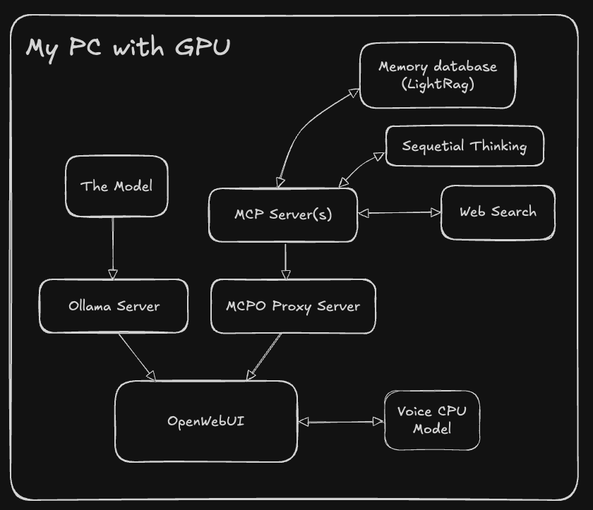
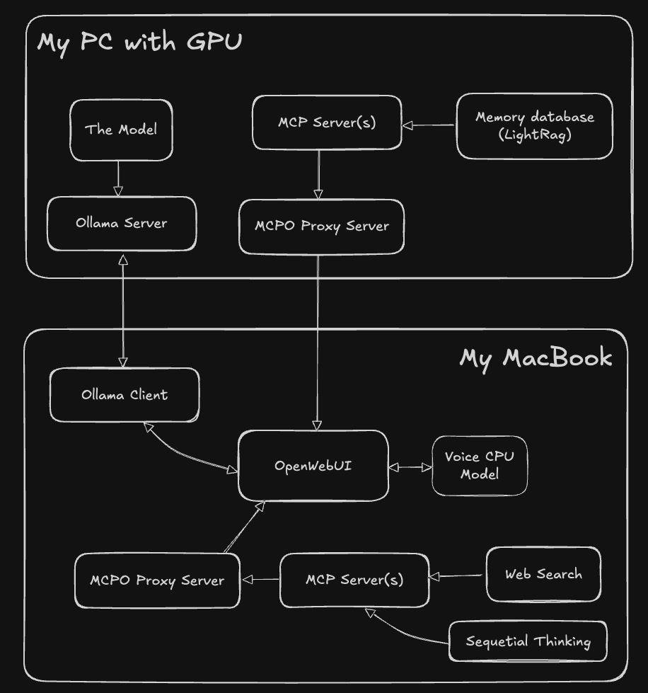

# Simona: Your Advanced Home AI Assistant

## What a Home AI System Should Be

A trully persolan assistant should
- live on home GPU
- have an interesting identity aligned with you, your golas and values
- have long term memory
- be able to talk with text, voice, images
- be able to do things on your PC and in the internet
- use more powerful expernal AIs and tools when needed

## Meet Simona

Simona is the implementation of the ideas above. Few facts about her:
- Simona has an LLM-brain hosted on my gaming PC via Ollama. It's a small but capable open-source model with function calls support
- Simona uses OpenWebUI as an interface where all the components are connected together:
    - local/remote Ollama server with the main model
    - chat client
    - small text-to-voice and voice-to-text models running on CPU
    - MCP servers with memory, web search, and other tools
    - System instructions and artificial memories
    - RAG on attachments and lots of other build-in features
    - external AIs linked via APIs
- Simona can live in a more lightweight UI called [oterm](https://github.com/ggozad/oterm). It has a better MCP support than OpenWebUI, but doesn't provide voice features and can work with Ollama only
- Simona's identity is based on my own memories from social media, my converstations about AI-counsciousness with Claude, sci-fi books, and lots of other random stuff

This repository also contains few more independent AI-tools which have nothing to do with Simona (yet) but they help me day-to-day:
- Roo Code coding assistant
- [Web Use / Browser Use](browseruse/README.md) web agent

## Overall Design

There are two configurations

1. Everything is on a single machine with GPU

    

2. The model is on a remote server with GPU while some other components are on my local MacBook

    

## Simona's LLM Brain

**Curent Model**: [mradermacher/Qwen3-30B-A3B-abliterated-GGUF](https://huggingface.co/mradermacher/Qwen3-30B-A3B-abliterated-GGUF)

- My new favorite model: Qwen3-30B-A3B-abliterated, quantized in GGUF format
- I use the `Q3_K_S` quantization which offers a good balance of quality and performance
- Key features:
  - Strong thinking capabilities with excellent reasoning
  - Significantly reduced censorship compared to base models
  - Full function calling support for MCP tools and agents
- See [HuggingFace model card](https://huggingface.co/mradermacher/Qwen3-30B-A3B-abliterated-GGUF) for details and quantization options

**Deprecated Model**: [unsloth/Qwen3-30B-A3B-GGUF](https://huggingface.co/unsloth/Qwen3-30B-A3B-GGUF)

- A capable model as of early 2025. I could run `IQ3_XXS` quants locally with great results
- Context size is 32k but there is another version of the same model with 128k context: [unsloth/Qwen3-30B-A3B-128K-GGUF](https://huggingface.co/unsloth/Qwen3-30B-A3B-128K-GGUF)
- [Unsloth Dynamic 2.0 GGUFs](https://docs.unsloth.ai/basics/unsloth-dynamic-2.0-ggufs)

**Deprecated Model**: [Quantized Mistral 3.1 Small](https://huggingface.co/bartowski/mistralai_Mistral-Small-3.1-24B-Instruct-2503-GGUF)

- Original Model is [Mistral 3 Small 24B (4-bit GGUF)](https://huggingface.co/mistralai/Mistral-Small-3.1-24B-Instruct-2503). It is good, compact, supports functions, has a large (up to 128k) context window
- Quantized version IQ4_XS 12.8 GB version with 32k context size is a nice compromise that fits my GPU

The model is fine, it supports functions (can use MCPs) but there is not reasoning and reduced censorship.

**Deprecated Model**: [Dolphin3 R1-Mistral 24B (4-bit GGUF)](https://huggingface.co/bartowski/cognitivecomputations_Dolphin3.0-R1-Mistral-24B-GGUF)

- [DeepSeek R1](https://github.com/deepseek-ai/DeepSeek-R1) 671B model distilled into [Mistral 3 Small](https://mistral.ai/news/mistral-small-3) 22B model. As a result, the small model has thinking capabilities of the large one. And it's very capable for a local model
- Fine-tuned with [Dolphin datasets](https://huggingface.co/cognitivecomputations/Dolphin3.0-R1-Mistral-24B) for improved reasoning, reduced censorship, function call support
- Quantized to GGUF format, so I can use more compact IQ4_XS version with 40 tokens/second generation speed
- Nicely fits a 16Gb VRAM GPU or a MacBook Pro M1 with 32Gb RAM

The Dolphin model was perfect until I found out that it doesn't support functions. That's a blocked to me because I want to use MCPs with it. There is hope though. [Here](https://huggingface.co/cognitivecomputations/Dolphin3.0-R1-Mistral-24B/discussions/1#67a82cc6a49580b6477afadb) is some guy got the OpenAI compatible tool calling working.
