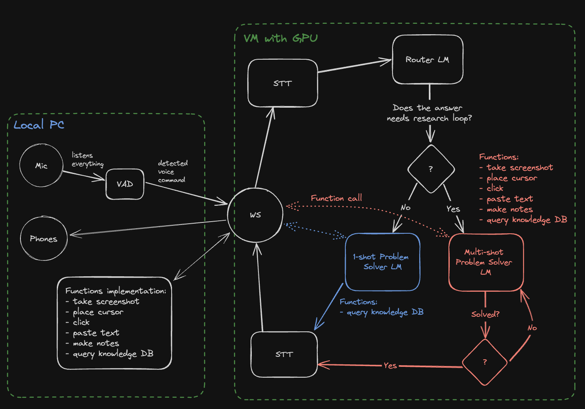

# Simona: AI Computer Operator

AI voice agent who is capable of seeing the screen, pressing buttons, and typing text, i.e. autonomously operating a computer on your behalf. It uses open-source local or self-hosted models with no dependencies on external APIs and sharing personal data with third parties.


# Design



Key components:
- Voice Activity Detection (VAD)
- Speech to Text (STT)
- Language Model (LM)
- Text to Speech (TTS)

# References and inspiration

I got inspired by the following projects:
- [self-operating-computer](https://github.com/OthersideAI/self-operating-computer/tree/main)
- [speech-to-speech](https://github.com/huggingface/speech-to-speech/tree/main)

The reason I don't fork them is that my vision is slightly different, and I want to learn how to create such system from scratch.

# Ollama and OpenWebUI setup

Run OpenWebUI from Docker with local Ollama servicer:
```bash
OpenWebUI: docker run -d -p 3000:8080 -e OLLAMA_BASE_URL=http://192.168.4.62:11434 -v open-webui:/app/backend/dat
a --name open-webui --restart always ghcr.io/open-webui/open-webui:main
```
Access OpenWebUI via URL: http://192.168.4.62:3000/

Enable mic in OpenWebUI in Chrome: `chrome://flags/#unsafely-treat-insecure-origin-as-secure`
Add: `http://192.168.4.62:3000`

How to enable Ollama network:  set env variable `OLLAMA_HOST=0.0.0.0`
How to download Huggingface model to Ollama: https://huggingface.co/docs/hub/en/ollama
How to configure Windows Firewall to enable network connections to Ollama and OpenWebUI (Win): TBD
How to configure local-remove Ollama connectivity: TBD
How to configure OpenWebUI to connect to Ollama service: TBD