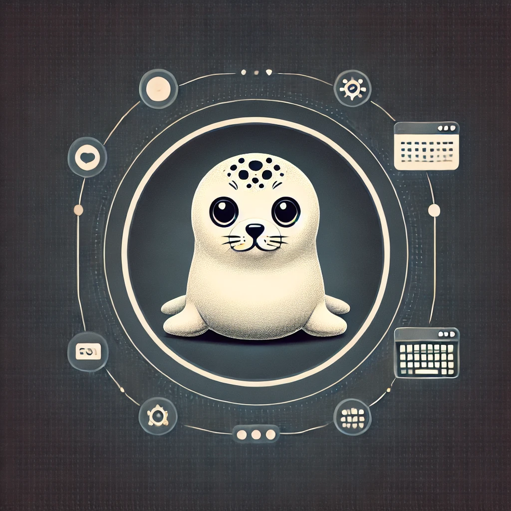
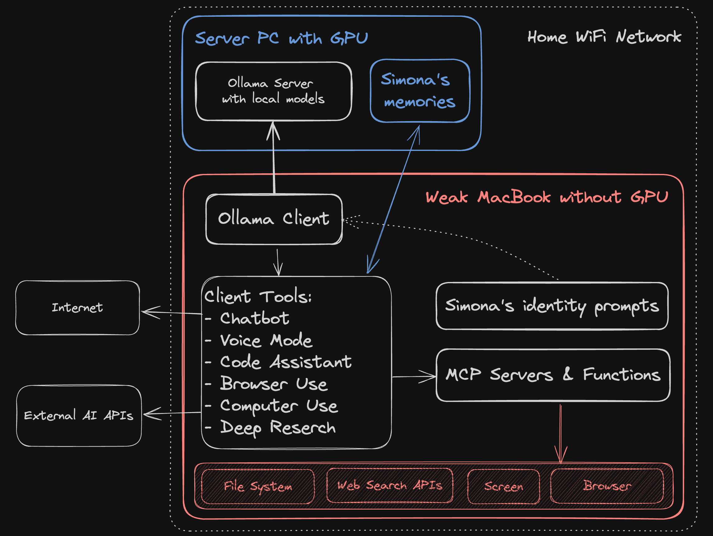
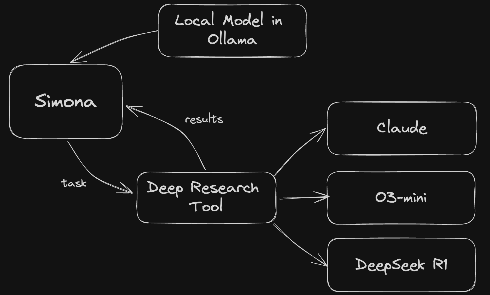

# Simona: Your Advanced Home AI Assistant

## What a Home AI System Should Do

A comprehensive home AI system should serve as your personal digital companion, offering assistance across multiple dimensions of your digital life while respecting privacy and providing local computation benefits. An ideal home AI system should:

### Core Capabilities
- **Always Available**: Accessible 24/7 from any device in your home network
- **Multimodal Interaction**: Support text, voice, and visual communication
- **Local Processing**: Run computations on your hardware for privacy and offline reliability
- **Diverse Skills**: Handle tasks from casual conversation to complex problem-solving
- **Digital Integration**: Seamlessly access and manage your files and applications
- **Customization**: Adapt to your specific needs and preferences
- **Task Delegation**: Know when to leverage external AI models for optimal results

## Meet Simona: Your AI Companion

Simona an an open-source model that runs locally and interacts to you with text, voice and specialized tools. She has her own personality and memory. Her goal is be alligned with the you.

**The Model**: [Quantized Dolphin3.0-R1-Mistral-24B-GGUF](https://huggingface.co/bartowski/cognitivecomputations_Dolphin3.0-R1-Mistral-24B-GGUF)
   - [DeepSeek R1](https://github.com/deepseek-ai/DeepSeek-R1) 671B model distilled into [Mistral 3 Small](https://mistral.ai/news/mistral-small-3) 22B model. As a result, the small model has thinking capabilities of the large one. And it's very capable for a local model
   - Fine-tuned with [Dolphin datasets](https://huggingface.co/cognitivecomputations/Dolphin3.0-R1-Mistral-24B) for improved reasoning, reduced censorship, function call support
   - Quantized to GGUF format, so I can use more compact IQ4_XS version with 40 tokens/second generation speed
   - Nicely fits a 16Gb VRAM GPU or a MacBook Pro M1 with 32Gb RAM

**Personality**
   - TBD

**The Architecture**
   - Runs on a GPU-enabled Ollama server
   - Powered by AMD 6850XT GPU with 16GB of VRAM
   - Supports both local and remote processing
   - Optimized for performance and reliability

[Learn more about Ollama integration](ollama/README.md)

### Interface and Interaction

Simona primarily interfaces through OpenWebUI, offering:

- **Local Model Access**: Direct connection to Ollama-hosted models
- **Remote API Integration**: Access to cloud-based models when needed
- **Voice Capabilities**: 
  - Text-to-Speech (TTS) for natural responses
  - Speech-to-Text (STT) for voice commands
- **Function Calling**: Custom functionality extension through programmable functions

[Explore OpenWebUI features](openwebui/README.md)

### Advanced Capabilities

#### Research and Web Integration
Simona can perform deep research and web browsing tasks, enabling:
- Comprehensive information gathering
- Real-time data analysis
- Web-based task automation

[Learn about browser capabilities](browseruse/README.md)

#### Task Orchestration
As a mastermind of State-of-the-Art (SOTA) models, Simona can:
- Evaluate task requirements
- Select appropriate specialized models
- Delegate and coordinate complex operations
- Integrate results for cohesive solutions

### Tools and Integrations

Simona leverages various tools and integrations to enhance her capabilities:

1. **Development Tools**
   - Code analysis and generation
   - Project management
   - Version control integration

2. **System Tools**
   - File system operations
   - Process management
   - Network connectivity

3. **Communication Tools**
   - Multi-modal interaction
   - API integrations
   - Data format conversions

4. **Automation Tools**
   - Task scheduling
   - Workflow automation
   - System monitoring
