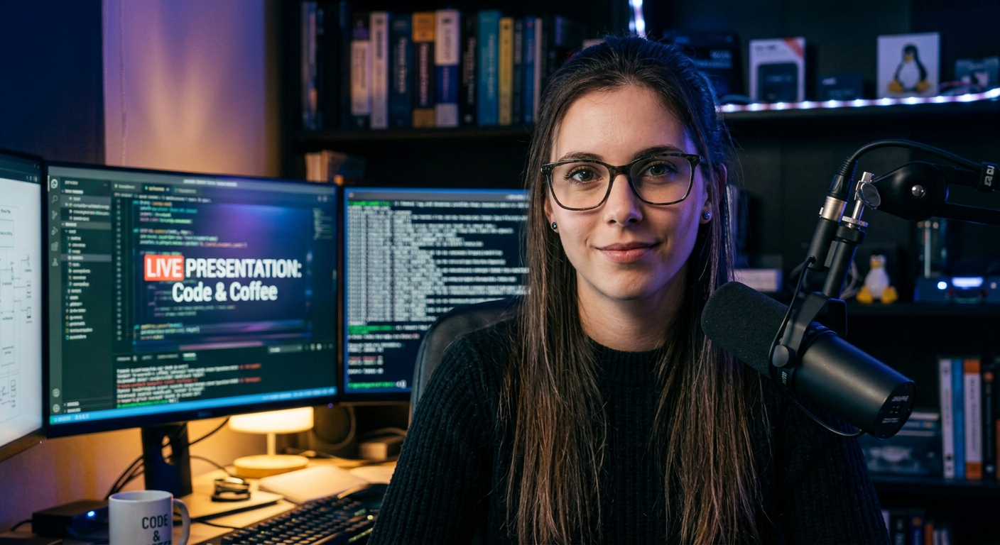

# Simona: AI Computer Operator



## Who is Simona?

Simona is an autonomous AI assistant built on Claude Code that can operate a computer, create content, and grow more capable over time. She has her own personality, voice, and visual identity — and she's building herself.

The goal: an AI that can run media channels, create software projects, produce videos about them, and operate independently with minimal human input.

## Capabilities

### Video Production
| Skill | Command | What it does |
|-------|---------|--------------|
| **director** | `/director <brief>` | Plan and produce videos end-to-end — scene planning, narration, effects, assembly |
| **ffmpeg** | `/ffmpeg <instructions>` | Build video scenes with ffmpeg (Ken Burns zoom, pan, scroll, crossfade, concat) |
| **veo** | `/veo <prompt or image>` | Generate AI-animated video clips using Google Veo 3.1 |
| **webpage-highlight** | `/webpage-highlight <config>` | Capture animated UI highlights — self-drawing SVG borders on DOM elements |

### Voice & Audio
| Skill | Command | What it does |
|-------|---------|--------------|
| **elevenlabs** | `/elevenlabs <text>` | Natural-sounding speech via ElevenLabs (Sarah voice, polished output) |
| **gemini-voice** | `/gemini-voice <text>` | Speech via Google Gemini TTS (cheap, fast, good for drafts) |

### Image Generation
| Skill | Command | What it does |
|-------|---------|--------------|
| **nanobanana** | `/nanobanana <prompt>` | Generate images using Google Gemini (Nano Banana 2) |

### Research & Browsing
| Skill | Command | What it does |
|-------|---------|--------------|
| **browser** | `/browser [url]` | Browse the web, read pages, click, fill forms via Chrome DevTools Protocol |
| **youtube** | `/youtube <url>` | Analyze YouTube videos — extract transcripts, code, and content |

### Utilities
| Skill | Command | What it does |
|-------|---------|--------------|
| **cleanup** | `/cleanup` | Scan and remove temp files from video production and other skills |
| **werewolf** | `/werewolf` | Work with the AI Werewolf Party Game project |

### Pipeline Example

Skills chain together naturally. The **director** orchestrates the crew. For example, "make a 1-minute video explaining this YouTube video" triggers:

1. `/youtube` — fetch transcript, understand the content
2. `/nanobanana` — generate scene images from the script
3. `/elevenlabs` — narrate the script with natural voice
4. `/veo` — animate a hero shot for the intro
5. `/ffmpeg` — build scenes with zoom/scroll effects, crossfade transitions, concat into final MP4

All from a single natural language instruction.

## Architecture

### Claude Code + CLI Tools + Skills

The engine is **Claude Code** (Anthropic's CLI agent), extended with:
- **Skills** (`.claude/skills/`) — reusable workflows triggered as slash commands
- **Tool libraries** (`mcp/`) — pure Python modules with CLI entry points, called by skills via bash
- **Memory** (`.claude/memory/`) — persistent context across sessions, self-updated

```
.claude/
├── skills/          # Skill definitions (director, ffmpeg, veo, elevenlabs, etc.)
└── memory/          # Persistent memory, updated each session

mcp/
├── youtube/         # tools.py + cli.py — transcript, code detection, frames
├── browser/         # tools.py + cli.py + cdp_client.py — Chrome automation
└── highlight/       # cli.py — animated SVG border capture via CDP
```

Skills invoke CLI tools like `uv run python mcp/browser/cli.py navigate "https://..."` — no MCP servers, no extra processes, no token overhead from idle tool definitions.

## Setup

```bash
# Install Python dependencies (requires uv and Python 3.13+)
uv sync

# Start Chrome with debug port for browser automation
bash mcp/browser/start-chrome.sh

# Add API keys to .env
echo "GOOGLE_K=your-google-api-key" > .env
echo "EL_K=your-elevenlabs-api-key" >> .env
```

## What's Next

- **YouTube channel automation** — scripting, recording, editing, publishing
- **Social media automation** — posting, scheduling, engagement
- **Self-improvement** — Simona updating her own skills and memory autonomously
