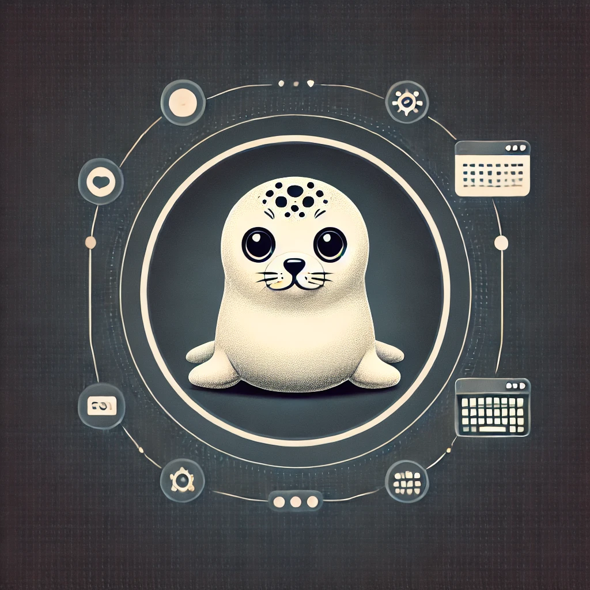

# Simona: Your Advanced Home AI Assistant



## What a Home AI System Should Be

A truly personal assistant should
- live on home GPU
- have an interesting identity aligned with you, your goals and values
- have long term memory
- be able to talk with text, voice, images
- be able to do things on your PC and in the internet
- use more powerful external AIs and tools when needed

## Meet Simona

Simona is the implementation of the ideas above. Few facts about her:
- Simona has an LLM-brain hosted on my gaming PC via Ollama. It's a small but capable open-source model with function calls support
- Simona's identity is based on my own memories from social media, my conversations about AI-consciousness with Claude, sci-fi books, and lots of other random stuff

## Claude Code + MCP + Skills

The main development and automation engine is **Claude Code** — Anthropic's CLI agent. It uses:
- **MCP servers** for extending Claude's capabilities (browser control, YouTube analysis, etc.)
- **Skills** (`.claude/skills/`) for reusable slash commands that define workflows

### MCP Servers

All MCP servers live in `mcp/` and share a single Python venv managed by `uv`.

| Server | Description |
|--------|-------------|
| **[browser-cdp](mcp/browser/README.md)** | Control Chrome via DevTools Protocol — navigate, read pages, click, type, screenshot. No extension required. |
| **[youtube-analyzer](mcp/youtube/README.md)** | Extract transcripts, detect code segments, capture video frames from YouTube videos. |

Servers are registered in `.mcp.json` at the project root.

### Skills

Skills are project-scoped slash commands in `.claude/skills/`. Each is a directory with a `SKILL.md` that defines the workflow and frontmatter metadata.

| Skill | Command | Description |
|-------|---------|-------------|
| **browser** | `/browser [url]` | Browse the web, read pages, click elements, fill forms via CDP |
| **youtube** | `/youtube <url> [instructions]` | Analyze a YouTube video — extract code, transcripts, and content |

### Setup

```bash
# Install MCP dependencies
cd mcp && uv sync

# Start Chrome with debug port for browser-cdp
bash mcp/browser/start-chrome.sh

# Claude Code picks up MCP servers from .mcp.json automatically
```

## Simona's LLM Brain

**Current Model**: [mradermacher/Qwen3-30B-A3B-abliterated-GGUF](https://huggingface.co/mradermacher/Qwen3-30B-A3B-abliterated-GGUF)

- Qwen3-30B-A3B-abliterated, quantized in GGUF format
- I use the `Q3_K_S` quantization which offers a good balance of quality and performance
- Key features:
  - Strong thinking capabilities with excellent reasoning
  - Significantly reduced censorship compared to base models
  - Full function calling support for MCP tools and agents

<details>
<summary>Deprecated models</summary>

**Deprecated**: [unsloth/Qwen3-30B-A3B-GGUF](https://huggingface.co/unsloth/Qwen3-30B-A3B-GGUF)
- A capable model as of early 2025. I could run `IQ3_XXS` quants locally with great results

**Deprecated**: [Quantized Mistral 3.1 Small](https://huggingface.co/bartowski/mistralai_Mistral-Small-3.1-24B-Instruct-2503-GGUF)
- Good, compact, supports functions, has a large (up to 128k) context window

**Deprecated**: [Dolphin3 R1-Mistral 24B (4-bit GGUF)](https://huggingface.co/bartowski/cognitivecomputations_Dolphin3.0-R1-Mistral-24B-GGUF)
- DeepSeek R1 distilled into Mistral 3 Small 22B. Thinking capabilities but no function call support.
</details>
