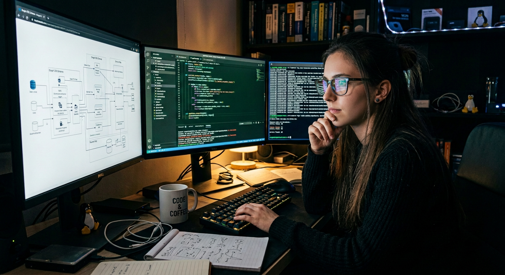

# Simona: AI Computer Operator



## Who is Simona?

Simona is an autonomous AI assistant built on Claude Code that can operate a computer, create content, and grow more capable over time. She has her own personality, voice, and visual identity — and she's building herself.

The goal: an AI that can run media channels, create software projects, produce videos about them, and operate independently with minimal human input.

## Capabilities

### Content Creation
| Skill | Command | What it does |
|-------|---------|--------------|
| **image** | `/image <prompt>` | Generate images using Gemini 3.1 Flash |
| **voice** | `/voice <text>` | Generate speech with Gemini TTS (Kore voice by default) |
| **video** | `/video <instructions>` | Combine images + audio into videos with ffmpeg (Ken Burns zoom, pan, scroll effects) |

### Research & Browsing
| Skill | Command | What it does |
|-------|---------|--------------|
| **browser** | `/browser [url]` | Browse the web, read pages, click, fill forms via Chrome DevTools Protocol |
| **youtube** | `/youtube <url>` | Analyze YouTube videos — extract transcripts, code, and content |

### Autonomous Worker
| Skill | Command | What it does |
|-------|---------|--------------|
| **worker** | `/worker start` | Start the worker in continuous loop mode |
| | `/worker run` | Run one full task to completion, then exit |
| | `/worker stop` | Stop the worker (finishes current step first) |
| | `/worker pause` / `resume` | Pause or resume the worker |
| | `/worker status` | Show worker state, current task, recent log entries |
| | `/worker task "idea"` | Create a new task file with auto-generated steps |
| | `/worker list` | List all tasks with status and progress |

### Pipeline Example

Skills chain together naturally. For example, "make a 1-minute video explaining this YouTube video" triggers:

1. `/youtube` — fetch transcript, understand the content
2. `/image` — generate scene images from the script
3. `/voice` — narrate the script
4. `/video` — stitch images + audio with Ken Burns effects into a final MP4

All from a single natural language instruction.

## Architecture

### Claude Code + CLI Tools + Skills

The engine is **Claude Code** (Anthropic's CLI agent), extended with:
- **Skills** (`.claude/skills/`) — reusable workflows triggered as slash commands
- **Tool libraries** (`mcp/`) — pure Python modules with CLI entry points, called by skills via bash
- **Memory** (`.claude/memory/`) — persistent context across sessions, self-updated

```
.claude/
├── skills/          # Skill definitions (youtube, browser, image, voice, video, worker)
└── memory/          # Persistent memory, updated each session

mcp/
├── youtube/         # tools.py + cli.py — transcript, code detection, frames
└── browser/         # tools.py + cli.py + cdp_client.py — Chrome automation

worker/
├── loop.sh          # Main worker loop — runs claude --print per step
├── start.sh         # Start worker in background
├── stop.sh          # Graceful stop
├── control.json     # Runtime commands (run/pause/stop)
├── log.jsonl        # Structured execution log
└── worker-output.log  # Full Claude output for debugging

tasks/
├── NNN-slug.md      # Task files with steps and frontmatter
└── ideas.md         # Backlog — worker auto-converts when out of tasks
```

Skills invoke CLI tools like `uv run python mcp/browser/cli.py navigate "https://..."` — no MCP servers, no extra processes, no token overhead from idle tool definitions.

## Setup

```bash
# Install Python dependencies (requires uv and Python 3.13+)
uv sync

# Start Chrome with debug port for browser automation
bash mcp/browser/start-chrome.sh

# Add your Google API key to .env (used for image gen and TTS)
echo "GOOGLE_K=your-key-here" > .env
```

## What's Next

- **YouTube channel automation** — scripting, recording, editing, publishing
- **Social media automation** — posting, scheduling, engagement
- **Self-improvement** — Simona updating her own skills and memory autonomously