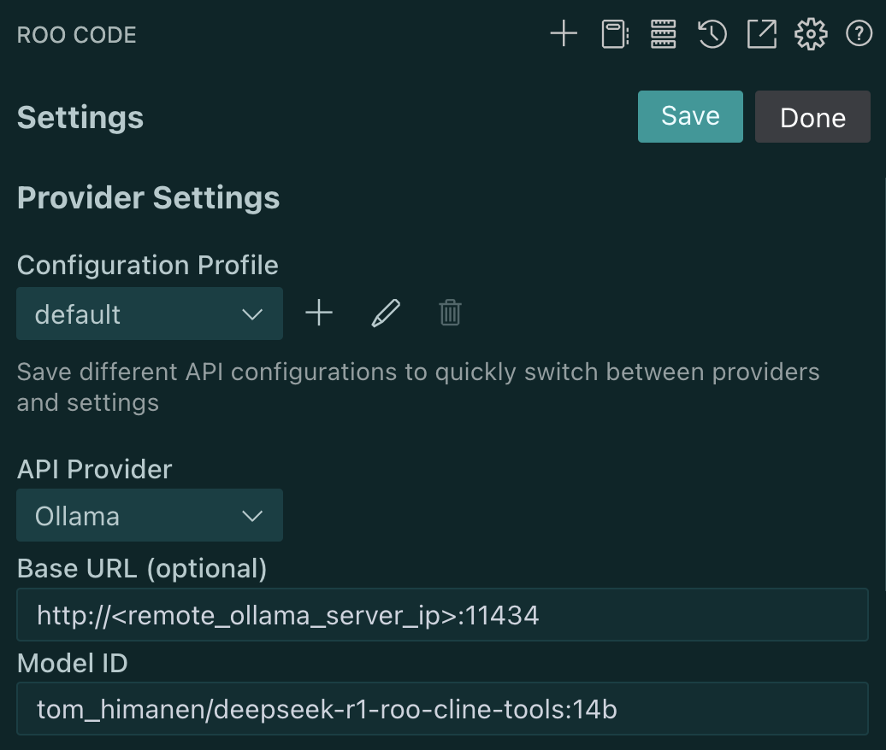

# Roo Code

I use VSCode + Roo Code free plugin combo for coding. It works the best with Claude Sonnet 3.7/3.5. For local run, we need a model with is small enough and fine-tunned for Cline/Roo Code prompts.

The [tom_himanen/deepseek-r1-roo-cline-tools](https://ollama.com/tom_himanen/deepseek-r1-roo-cline-tools:8b/blobs/34c954d88bb4) model works fine locally.

Performance on my old 16Gb VRAM GPU:
- 8B version: 45 tokens/s
- 14B version: 10 tokens/s (feels painfully slow, so I use 8B)

# Setup

1. Download VSCode, it's free
2. Then download Roo Code extension, it is also free
3. Then download and run the model via Ollama:
    ```bash
    ollama run tom_himanen/deepseek-r1-roo-cline-tools:8b
    ```
4. Configure Roo Code to use the model:

   
